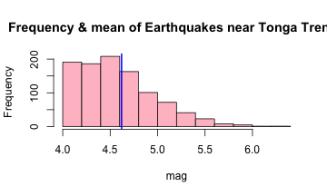

## Locations of Earthquakes occurring near the Tonga Trench 

This is a presentation to show the frequency of earthquakes that occur near the Tonga Trench using various data products.  The presentation will utilize multiple products that were demonstrated in the 'Developing Data Products' course offered by [Coursera](https://www.coursera.org/). The data used in this presentation is comprised of the "quake" dataset,available in RStudio, and from [R bollerqvist](http://ekqvist.goeuropeinfo.com/rbloggerqvist). The Classifications of the earthquakes were obtained from the [Michigan Tech University UPSeis website](http://www.geo.mtu.edu/UPSeis/magnitude.html). 

 

--- .class #id
 
## Data Products 

The following data products were used in this presentation. 
> - [Slidify](http://slidify.org/) Reproducible HTML5 slide decks 
> - [Shiny](http://shiny.rstudio.com/) Create interactive web application 
> - [Google Chart Tools](https://developers.google.com/chart/) Interactive charts for brosers 
> - [GitHub](https://www.github.com) Web-based Git repository hosting service 
> - [RPubs](http://rpubs.com/) Web Publishing from R

The GitHub for this entire project is available on: [https://github.com/CjustC/Developing_Data_Products](https://github.com/CjustC/Developing_Data_Products) 
 

--- .class #id

## Interactive Fiji Map

<!DOCTYPE html PUBLIC "-//W3C//DTD XHTML 1.0 Strict//EN"
  "http://www.w3.org/TR/xhtml1/DTD/xhtml1-strict.dtd">
<html xmlns="http://www.w3.org/1999/xhtml">
<head>
<title>GeoMapIDfb616499dd6</title>
<meta http-equiv="content-type" content="text/html;charset=utf-8" />

</head>
<body>
 <!-- GeoMap generated in R 3.2.4 by googleVis 0.5.10 package -->
<!-- Sun May  1 17:17:37 2016 -->

<!-- jsHeader -->

 
<!-- jsChart -->  

 
<!-- divChart -->
  

 
Data: quakes &#8226; Chart ID: <a href="Chart_GeoMapIDfb616499dd6.html">GeoMapIDfb616499dd6</a> &#8226; <a href="https://github.com/mages/googleVis">googleVis-0.5.10</a>  
<!-- htmlFooter -->
 
  R version 3.2.4 (2016-03-10) 
  &#8226; <a href="https://developers.google.com/terms/">Google Terms of Use</a> &#8226; <a href="https://google-developers.appspot.com/chart/interactive/docs/gallery/geomap">Documentation and Data Policy</a>

</body>
</html>

The map shows the earthquake occurrences near the Tonga Trench based on the "quakes" data. Hovering over the green circles displays the station number and magnitude of each quake. The green gradient levels as shown in the "legend" denotes magnitude level. 

--- .class #id

## Shiny Application 

The [Shiny application](https://minionapp.shinyapps.io/quake_app/) demonstrates the classification of earthquakes located near the Tonga Trench. The user interaction is to move the slider to any point within the slider range and the application will output the classification of the earthquake. The Shiny App can be found at [https://minionapp.shinyapps.io/quake_app/](https://minionapp.shinyapps.io/quake_app/).

 

